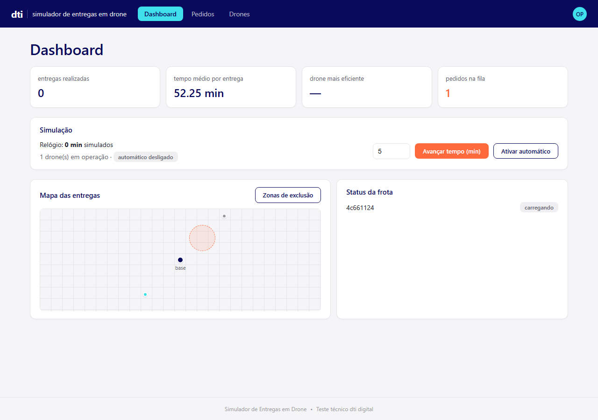
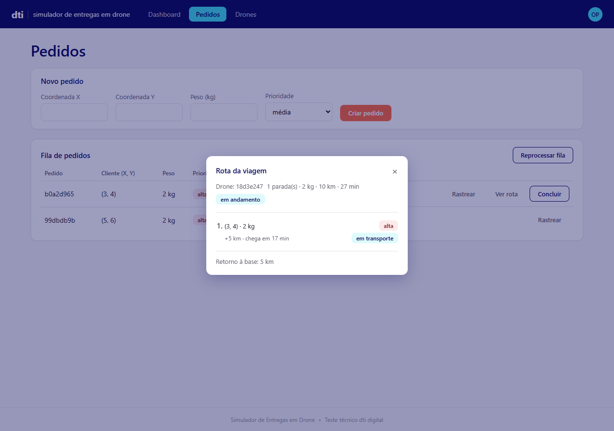
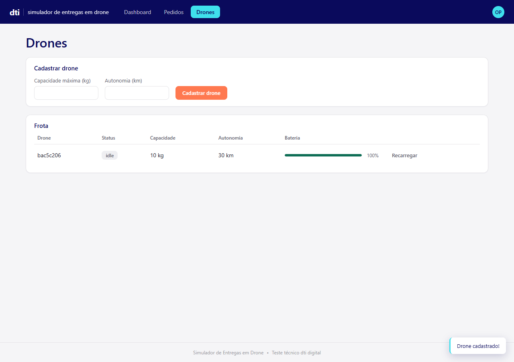
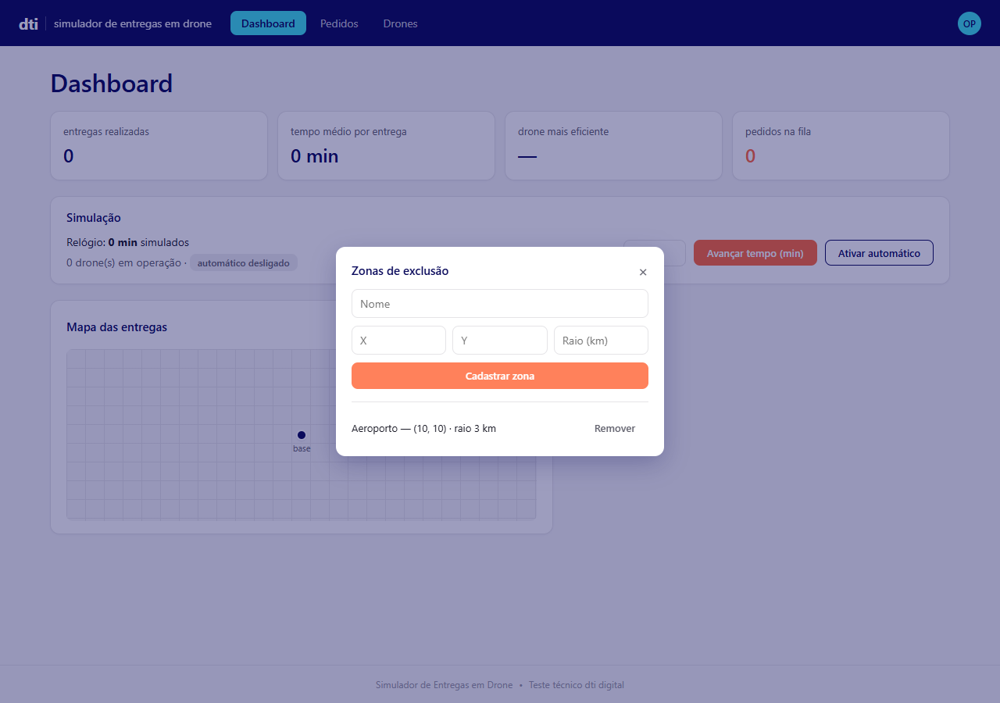

# 🚁 Simulador de Entregas em Drone

Simulador de operação logística por drones em ambiente urbano, desenvolvido como desafio técnico para o processo seletivo da **dti digital** (Enterprise Hakuna). O sistema aloca pedidos em drones respeitando capacidade, autonomia, prioridade e zonas de exclusão aérea, simula o voo em tempo acelerado e expõe tudo isso numa interface web.


---

## 📑 Sumário

- [Sobre o projeto](#sobre-o-projeto)
- [Funcionalidades](#funcionalidades)
- [Stack tecnológico](#stack-tecnológico)
- [Screenshots](#screenshots)
- [Como executar](#como-executar)
- [Testes](#testes)
- [Principais endpoints da API](#principais-endpoints-da-api)
- [Decisões técnicas](#decisões-técnicas)
- [Estrutura do projeto](#estrutura-do-projeto)
- [Autor](#autor)

---

## Sobre o projeto

Uma startup de logística quer testar entregas por drones em áreas urbanas. Este projeto simula a operação: pedidos chegam com localização, peso e prioridade; drones são cadastrados com capacidade e autonomia próprias; e o sistema decide sozinho **quem entrega o quê, em qual ordem, em quantas viagens**.

O backend é uma API REST em Spring Boot com um simulador orientado a eventos (o "relógio" da operação pode ser avançado manualmente ou rodar sozinho). O frontend é uma SPA em React que consome essa API em tempo real — dashboard com KPIs e mapa, cadastro/monitoramento de drones, e criação/acompanhamento de pedidos.

## Funcionalidades

### Regras básicas
- Cadastro de drones com capacidade máxima (kg) e autonomia (km)
- Cidade mapeada como malha de coordenadas 2D
- Pedidos com localização (X, Y), peso e prioridade (baixa / média / alta)
- Alocação automática buscando o **menor número de viagens possível**

### Funcionalidades avançadas
- 🔋 Bateria do drone consumida por viagem (distância da rota) e recarregada automaticamente ao retornar à base
- 🚫 Zonas de exclusão aérea — pedidos cuja rota cruza uma zona ficam bloqueados até ela ser removida
- ⏱️ Cálculo de tempo total estimado de entrega
- 📋 Fila de entrega ordenada por prioridade e, em empate, por ordem de chegada (FIFO)

### Diferenciais
- 🧠 **Otimização inteligente**: knapsack (programação dinâmica) por nível de prioridade — busca a combinação de pedidos que **maximiza o peso carregado** em cada viagem, sem nunca sacrificar prioridade por eficiência
- 🔄 Modelo de simulação com estados: `Idle → Carregando → Em voo → Entregando → Retornando → Idle`
- ⏳ Tempo de voo simulado com relógio próprio (avanço manual ou automático)
- 🔌 API RESTful com endpoints bem definidos (veja a [tabela abaixo](#principais-endpoints-da-api))

### Valide, analise e inove
- ✅ 68 testes automatizados (regras de negócio + simulação de carga com 300 pedidos / 50 drones)
- ⚠️ Validações com mensagens claras (ex: peso acima da capacidade de todos os drones cadastrados)
- 📊 Dashboard com entregas realizadas, tempo médio, drone mais eficiente, fila e **mapa visual interativo**
- 💡 Criativos: recarga automática ao retornar à base, e feedback de rastreio ao estilo *"seu pacote está a 2 km de distância"*

## Stack tecnológico

**Backend**
| | |
|---|---|
| Linguagem | Java 21 |
| Framework | Spring Boot 4.1 (Web, Data JPA, Validation) |
| Banco de dados | H2 (em memória) |
| Testes | JUnit 5 + Mockito + AssertJ |
| Build | Maven (wrapper incluso) |

**Frontend**
| | |
|---|---|
| Framework | React 19 |
| Build tool | Vite 8 |
| Roteamento | React Router 7 |
| Estilo | CSS puro, sem framework de UI |

## Screenshots

**Dashboard** — KPIs, controle de simulação, status da frota e mapa interativo com zonas de exclusão


**Pedidos** — fila de entregas com rastreio e detalhe de rota por viagem


**Drones** — frota com status, bateria e notificações de confirmação


**Zonas de exclusão** — CRUD de áreas restritas direto do dashboard


## Como executar

### Pré-requisitos
- Java 21+
- Node.js 18+
- Não precisa instalar Maven — o projeto já inclui o wrapper (`mvnw`)

### 1. Backend

```bash
cd backend
./mvnw spring-boot:run        # Linux/macOS/Git Bash
# ou
mvnw.cmd spring-boot:run      # Windows (cmd/PowerShell)
```

A API sobe em `http://localhost:8080`. O banco H2 é em memória — reinicia zerado a cada execução.

### 2. Frontend

Em outro terminal:

```bash
cd frontend
npm install
npm run dev
```

A aplicação abre em `http://localhost:5173`.

> O frontend espera a API em `http://localhost:8080/api`. Pra apontar pra outro endereço, defina `VITE_API_BASE_URL` num arquivo `.env` dentro de `frontend/`.

## Testes

```bash
cd backend
./mvnw test
```

68 testes cobrindo: alocação e otimização de pedidos, máquina de estados da simulação, zonas de exclusão (geometria segmento-círculo), status/rastreio, e um teste de carga com 300 pedidos distribuídos entre 50 drones.

## Principais endpoints da API

| Método | Rota | Descrição |
|---|---|---|
| `POST` | `/api/pedidos` | Cria um pedido (aloca automaticamente se houver drone disponível) |
| `GET` | `/api/pedidos` | Lista todos os pedidos |
| `PUT` | `/api/pedidos/{id}/concluir` | Marca uma entrega como concluída |
| `POST` | `/api/pedidos/processar-fila` | Força o reprocessamento da fila |
| `GET` | `/api/pedidos/dashboard` | KPIs consolidados |
| `GET` | `/api/pedidos/{id}/rastreio` | Feedback de status/distância ao cliente |
| `POST` | `/api/drones` | Cadastra um drone |
| `GET` | `/api/drones/status` | Status detalhado da frota (bateria, viagem atual etc.) |
| `PUT` | `/api/drones/{id}/recarregar` | Recarrega a bateria manualmente |
| `GET` | `/api/entregas/rota/{viagemId}` | Detalhe completo de uma rota (paradas, distâncias, tempos) |
| `POST` | `/api/zonas-exclusao` | Cadastra uma zona de exclusão |
| `DELETE` | `/api/zonas-exclusao/{id}` | Remove uma zona |
| `POST` | `/api/simulacao/avancar?minutos=N` | Avança o relógio da simulação |
| `POST` | `/api/simulacao/automatica?ativo=true` | Liga/desliga o avanço automático |

## Decisões técnicas

Algumas escolhas conscientes que valem explicar:

- **Otimização por knapsack, não por busca exaustiva**: a alocação usa programação dinâmica (0/1 knapsack) por nível de prioridade pra maximizar peso por viagem, em vez de testar todas as combinações possíveis — mantém a alocação rápida mesmo com centenas de pedidos, ao custo de não garantir o ótimo global entre prioridades diferentes (o que, aliás, seria indesejado: prioridade sempre vem antes de eficiência).
- **Zonas de exclusão bloqueiam a rota, não a desviam**: o sistema verifica se o caminho até o pedido cruza uma zona e bloqueia a entrega até ela ser removida. Calcular uma rota alternativa contornando o obstáculo é um problema de motion planning bem mais complexo, fora do escopo pedido.
- **Reprocessamento automático da fila**: sempre que um drone fica disponível (cadastro, recarga, ou remoção de uma zona que bloqueava uma rota), a fila é reprocessada automaticamente — não só ao criar um pedido.
- **H2 em memória**: escolhido pela simplicidade de rodar o projeto localmente sem configuração extra. A troca por um banco persistente (ex: PostgreSQL/Neon) é direta graças ao Spring Data JPA.

## Estrutura do projeto

```
dti-drone-delivery-case/
├── backend/            # API REST (Spring Boot)
│   └── src/main/java/com/dtidigital/simulador/
│       ├── controller/  # Endpoints REST
│       ├── service/     # Regras de negócio (alocação, simulação, zonas)
│       ├── model/       # Entidades JPA
│       ├── dto/         # Objetos de transferência
│       └── config/      # Parâmetros da simulação, CORS
└── frontend/            # SPA (React + Vite)
    └── src/
        ├── pages/        # Dashboard, Pedidos, Drones
        ├── components/   # Componentes reutilizáveis (Button, Card, Modal, mapa...)
        ├── api/          # Camada de acesso à API
        └── utils/        # Mapeamento de labels/cores por status
```

## Autor

Desenvolvido por **Fillipe Gabriel** para o processo seletivo dti digital.
